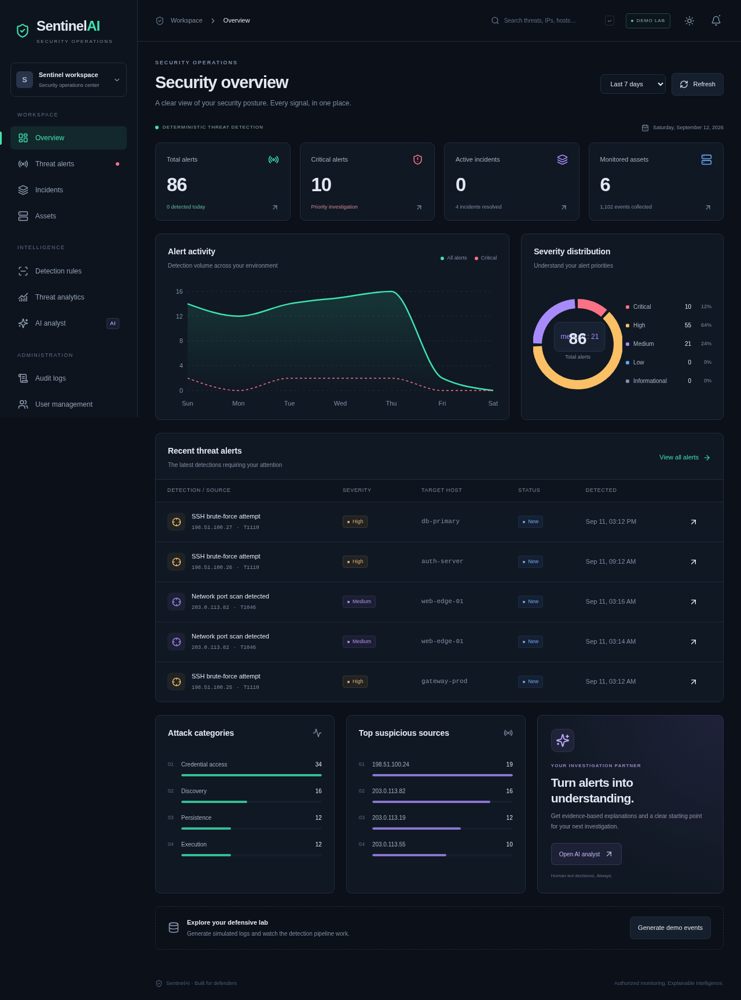
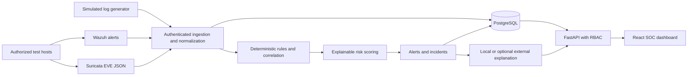

# SentinelAI

**AI-Powered Security Operations & Threat Detection System**

A defensive cybersecurity capstone: collect logs, correlate suspicious behavior, score risk transparently, investigate alerts, and document incidents through a responsive SOC dashboard. Deterministic rules detect activity; an optional AI provider explains existing detections. No feature executes log contents, launches attacks, or performs automatic containment.



[View mobile screenshot](docs/dashboard-mobile.png) · [Verification results](docs/VERIFICATION.md)

## Quick start

Requirements: Docker Engine with Docker Compose, or a working Podman Docker-compatible API; Python 3 to generate local credentials.

```sh
python3 scripts/configure.py
docker compose up --build
```

Open **http://localhost:8080**. API documentation: **http://localhost:8000/docs**.

- Sign in as `admin@sentinelai.local` using the unique `BOOTSTRAP_ADMIN_PASSWORD` generated in your private `.env`.
- Click **Generate demo events** on Overview or Settings. This creates simulated records through the real ingestion and detection pipeline.
- Select related alerts and choose **Create incident**. Add notes, assign an analyst, and supply a resolution before closing an incident.
- Register a second user through the login page. New users receive Viewer access; promote them through User management as an administrator.

There is no shared demo password. `configure.py` does not replace an existing `.env`. The generated credentials are for your local lab. Run `docker compose up` on subsequent starts. Stop with `docker compose down`; the PostgreSQL volume persists. Do not remove the volume unless you intend to discard its data.

## Local development

Python 3.14 and Node.js 22.12+ are the tested target stack. SQLite is available for lightweight local work; PostgreSQL is the production target.

```sh
python3 scripts/configure.py
python3 -m venv .venv
.venv/bin/pip install -r backend/requirements.lock
cd backend
../.venv/bin/alembic upgrade head
../.venv/bin/uvicorn app.main:app --reload --host 127.0.0.1 --port 8000
```

In another terminal, from the repository root:

```sh
npm ci --prefix frontend
npm run dev --prefix frontend -- --host 127.0.0.1
```

Open **http://localhost:5173**. Vite proxies `/api` to the backend. Local configuration is read from `../.env` when running inside `backend/`. Set `DATABASE_URL` to a PostgreSQL SQLAlchemy URL to use PostgreSQL outside Compose. Run migrations before starting the backend; application startup never silently creates schema.

## Features

- Argon2id password hashing; 15-minute JWT access tokens; seven-day rotating, hashed refresh sessions; logout revocation; Admin/Analyst/Viewer permissions.
- Database-backed rate limits, bounded request bodies, validated IPs/ports/timestamps, restricted CORS, security headers, redacted validation errors, and audit records without secrets.
- Ten detections: SSH brute force, port scanning, repeated failures, success after failures, password spraying, unusual login source, suspicious processes, sensitive file changes, Suricata signatures, and Wazuh alerts.
- Explainable 0–100 risk scoring, linked original events, configurable ATT&CK mappings, rule enable/disable controls, and safe Sigma-subset parsing.
- Search and pagination; alert status, assignment, and notes; many-to-many incident grouping; investigation timelines and resolution tracking.
- Automatically observed asset inventory, administrator-managed OS/sensitivity, trends, severity distribution, categories, source IPs, hosts, accounts, and mean incident resolution time.
- JSON/NDJSON Wazuh and Suricata imports; collector API-key support; optional HTTPS AI adapter with validated response structure and a local fallback.
- Responsive dark/light interface with login, overview, alerts, alert details, incidents, incident details, assets, rules, analytics, AI analyst, audit, settings, and users pages.

## Architecture



The API, detection engine, scoring, adapters, and AI providers live in separate modules. Events and detection history are persisted. PostgreSQL ingestion uses an advisory transaction lock to serialize batches and avoid correlation races. Exact event IDs are idempotent; aggregate rules use rolling suppression per source, host, and rule.

## Project structure

```text
SentinelAI/
├── backend/
│   ├── app/
│   │   ├── api/          # Authentication and operations routes
│   │   ├── core/         # Settings, hashing, JWT, permissions, rate limits
│   │   ├── database/     # SQLAlchemy engine and sessions
│   │   ├── models/       # Persistent security operations schema
│   │   ├── schemas/      # Pydantic input validation
│   │   ├── detection/    # Safe rule parser, correlations, risk scoring
│   │   ├── integrations/# Wazuh and Suricata normalization
│   │   ├── ai/           # Provider interface and evidence-grounded fallback
│   │   ├── services/     # Ingestion, demo generation, analytics
│   │   └── main.py       # Lifespan, middleware, API composition
│   ├── migrations/versions/
│   ├── tests/
│   ├── requirements.txt # Compatible dependency ranges
│   ├── requirements.lock# Exact verified dependencies
│   └── Dockerfile
├── frontend/
│   ├── src/{components,pages,services,hooks,types,utils}/
│   ├── e2e/             # Chromium analyst workflow
│   ├── public/
│   ├── nginx.conf
│   └── Dockerfile
├── rules/               # Ten safe YAML rule definitions
├── sample-data/         # Inert sensor examples
├── scripts/             # Credential setup and log import helpers
├── docs/                # Schema, API, integrations, security and defense notes
├── .github/workflows/ci.yml
├── .env.example
└── docker-compose.yml
```

## Configuration

`.env.example` describes all settings. `scripts/configure.py` generates strong random secrets and a private mode-0600 `.env`. Compose supplies its own PostgreSQL `DATABASE_URL`; the local development default is SQLite.

| Setting | Purpose |
| --- | --- |
| `JWT_SECRET` | At least 32 characters; generated per installation |
| `BOOTSTRAP_ADMIN_EMAIL`, `BOOTSTRAP_ADMIN_PASSWORD` | Create the first admin if that email does not exist; not a password-reset mechanism |
| `INGEST_API_KEY` | Collector-only ingestion credential, never sent to the browser |
| `DEMO_MODE` | Enables administrator-only simulated event generation |
| `REGISTRATION_ENABLED` | Enables viewer self-registration |
| `CORS_ORIGINS` | Comma-separated exact browser origins |
| `COOKIE_SECURE` | Require HTTPS refresh cookies in production |
| `ENVIRONMENT` | `production` enforces strong JWT configuration, PostgreSQL, secure cookies, and no demo mode |
| `AI_PROVIDER` | `local` by default, or `external` |
| `AI_API_URL`, `AI_API_KEY`, `AI_MODEL` | Optional HTTPS chat-completions-compatible provider |

Production requires TLS termination, correctly restricted ingress, and an operator-managed secret store. Compose binds exposed services to loopback. The included HTTP setup is a local lab configuration.

## Database and API

See [schema and API reference](docs/API.md) for the complete table and endpoint lists. Interactive OpenAPI is generated at `/docs`, with machine-readable schema at `/openapi.json`.

```sh
cd backend
../.venv/bin/alembic upgrade head
../.venv/bin/alembic check
```

Create future migrations with `alembic revision --autogenerate -m "Describe schema change"`, review them, and apply with `alembic upgrade head`. The initial migration contains explicit frozen table definitions rather than importing mutable application models.

## Detection rules and ATT&CK

See [detection design](docs/DETECTION.md). Rules use YAML and the Sigma `detection.selection` / `condition: selection` structure. Only equality, list OR, `contains`, `startswith`, and `endswith` are supported; fields within a selection are ANDed. The `sentinel` block defines bounded correlation windows and technique metadata. General Sigma conditions, regex, wildcards, and full Sigma correlation syntax are intentionally rejected or unsupported; this is not a complete Sigma execution backend.

Mappings are review context. A sensor signature or sensitive-file change alone cannot prove an ATT&CK technique. The broad Wazuh/Suricata fallback mappings must be tuned to the specific sensor rule in a real deployment.

## Wazuh and Suricata

The default stack does not install these heavier sensors. Deploy them separately in your authorized lab and import their JSON alerts through **Threat alerts → Import logs** or the collector helper:

```sh
.venv/bin/python scripts/import_logs.py suricata sample-data/suricata-eve.json
.venv/bin/python scripts/import_logs.py wazuh sample-data/wazuh-alert.json
```

The helper reads the local collector key without placing it in command arguments. See [integration and lab guide](docs/INTEGRATIONS.md) for field mappings, batch behavior, and deployment boundaries.

## AI module

The default explanation is deterministic and works offline. It returns separate observed evidence, interpretation, possible impact, investigation steps, and recommendations. The optional external adapter receives a compact detection summary without raw event messages, IPs, hostnames, or usernames. Provider output cannot replace evidence or modify detections. Provider failures and invalid output fall back to the local explanation. External recommendations remain unverified and require analyst review.

## Verification

```sh
cd backend
../.venv/bin/pytest -q
../.venv/bin/ruff check .
cd ../frontend
npm test
npm run build
npm audit
cd ..
.venv/bin/pip-audit -r backend/requirements.lock
```

With the local application running and `.env` generated:

```sh
cd frontend
npx playwright test
```

Chromium defaults to `/usr/bin/chromium`; set `CHROMIUM_PATH` if needed. `SENTINEL_E2E_URL` can target a different local frontend. Browser tests create simulated events and an incident in the selected development database. Screenshots are written to `docs/`. See [verification report](docs/VERIFICATION.md) for results and the limits of these checks.

## Security considerations and limitations

Read [security design](docs/SECURITY.md). This is a working capstone, not a managed enterprise SIEM. Important limits include synchronous ingestion, serialized PostgreSQL batches, an in-process web tier, limited Sigma syntax, no retention scheduler, and no streaming collector daemon. SQLite is for single-process development. Login-source history is scoped to one host and a 24-hour baseline. Late events are sorted within a batch; arrival of older events in later batches does not retroactively rerun past detections.

No MFA, SSO, account-recovery email, tenant isolation, tamper-evident audit storage, or automatic response is included. Asset activity reflects observed event timestamps, not sensor heartbeat connectivity. Incident closure does not automatically close linked alerts. The API has not undergone independent penetration testing or load certification.

## Future improvements

Add a queue and scalable correlation workers, event partitioning and retention, per-collector credentials with rotation, Redis-backed rate limiting, MFA/OIDC, richer Sigma support via pySigma, rule-specific sensor ATT&CK mappings, versioned rule lifecycle, immutable audit export, streaming log shippers, and retrieval grounded in an approved response knowledge base.

## Presentation and references

[Project defense notes](docs/PROJECT_DEFENSE.md) explain the architecture, design decisions, limitations, and a short demonstration sequence. Screenshots are real local application captures; replace them with your own environment captures before publishing.

Primary implementation references: [FastAPI authentication](https://fastapi.tiangolo.com/tutorial/security/oauth2-jwt/), [Sigma rule format](https://sigmahq.io/docs/basics/rules.html), [MITRE Brute Force](https://attack.mitre.org/techniques/T1110/), [MITRE Network Service Discovery](https://attack.mitre.org/techniques/T1046/), [Wazuh alert management](https://documentation.wazuh.com/current/user-manual/manager/alert-management.html), and [Suricata EVE JSON](https://docs.suricata.io/en/latest/output/eve/eve-json-output.html).
